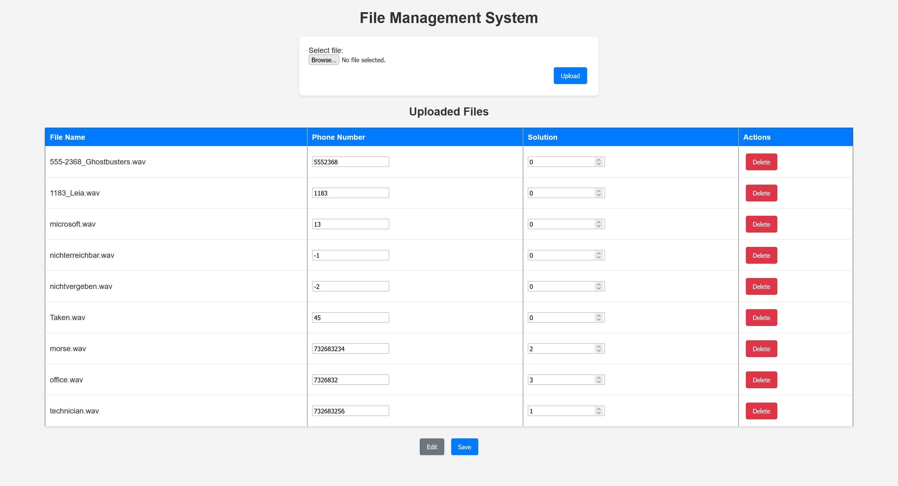
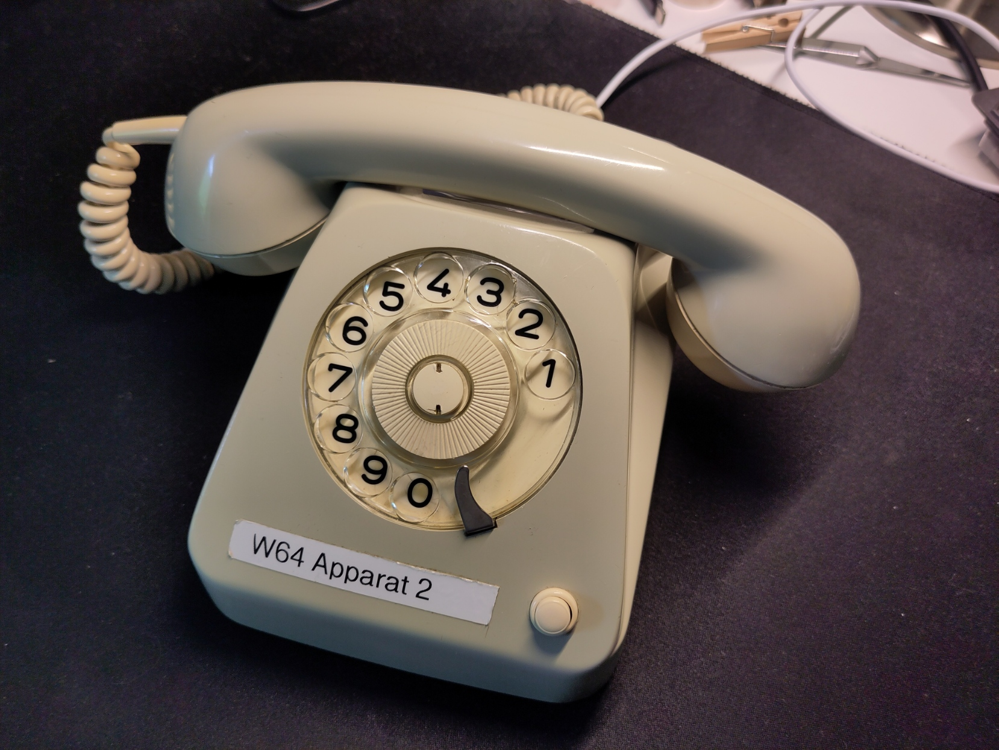
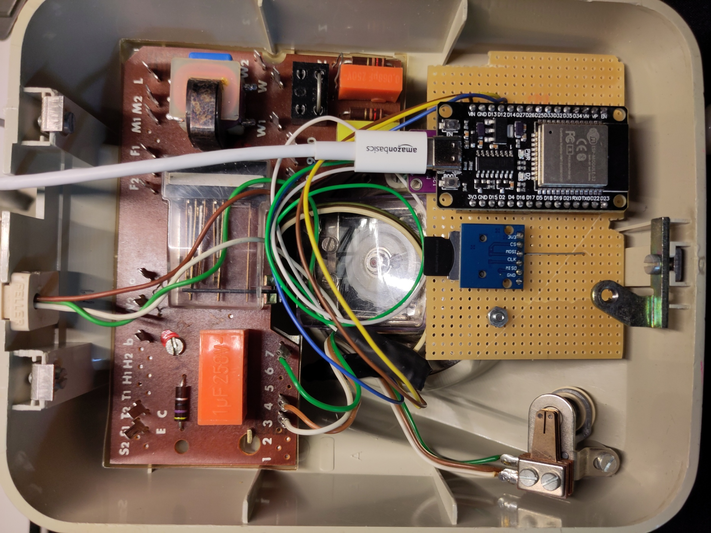

# Rotary Phone Puzzle

This puzzle uses a old POTS rotary phone with an ESP32, a SPI SD-card reader and a MAX98257 to detect the pulse dialing. If the correct phone numbers are dialed, the puzzle is solved.


## Pinout

The following pinout is used for the ESP32 connections based on the configuration in [`config.h`](./RotaryPhonePIO/src/config.h):


###  Connections

| Component | Connection | ESP32 Pin |
|-----------|------------|-----------|
| MAX98357 | BCK (Bit Clock) | GPIO 26 |
| MAX98357 | LRC (Word Select) | GPIO 12 |
| MAX98357 | DIN (Data Input) | GPIO 32 |
| MAX98357 | GAIN | Not Connected |
| MAX98357 | SD (Shutdown) | Not Connected|
| MAX98357 | VIN | 3.3V |
| MAX98357 | GND | GND |
| SD Card Reader | CS (Chip Select) | GPIO 5 |
| SD Card Reader | MOSI (SPI Data) | GPIO 23 |
| SD Card Reader | MISO (SPI Data) | GPIO 19 |
| SD Card Reader | SCK (SPI Clock) | GPIO 18 |
| SD Card Reader | VCC | 3.3V |
| SD Card Reader | GND | GND |
| Rotary Phone | Pulse Line | GPIO 14 |
| Rotary Phone | Ground | GND |

## Setup

### Prerequisites
- PlatformIO IDE or Visual Studio Code with PlatformIO extension
- ESP32 development board
- MAX98257 I2C audio amplifier
- Generic SPI SD-card reader
- MicroSD card (formatted as FAT32)
- Audio files in WAV format (44.1kHz Stereo)

### Software Configuration
The folder [`RotaryPhonePIO`](./RotaryPhonePIO) contains a PlatformIO project that can be uploaded to the ESP32.

1. Copy [`credentials_template.h`](./RotaryPhonePIO/src/credentials_template.h) to `credentials.h` and configure:
   - WiFi credentials (SSID and password)
   - MQTT broker settings
   - Other network configurations

2. Configure [`config.h`](./RotaryPhonePIO/src/config.h) if needed:
   - Authentication for the MQTT broker
   - Webserver for file management
   - Debug output

3. Create the necessary audio files.

4. Create a [`mapping.txt`](./RotaryPhonePIO/data/mapping.txt) in a csv format, each line consists of:
```
<audio_file>,<phone_number>,<rank>
```
- `rank 0`: Easter egg (can be played anytime)
- `rank 1-N`: Sequential puzzle steps (must be completed in reverse order)

5. Prepare SD card with:
   - Audio files
   - [`mapping.txt`](./RotaryPhonePIO/data/mapping.txt)
   - [`index.html`](./RotaryPhonePIO/data/index.html) if using the webserver

### Installation
```bash
# Build and upload using PlatformIO
pio run --target upload
```

## Usage

### Basic Operation
1. Power on the ESP32 and wait for WiFi connection
2. The device will connect to the configured MQTT broker and publish a `I am online` message
3. The base station must send a initialize message via MQTT in the general topic.
4. Dial phone numbers in the correct order specified in [`mapping.txt`](./RotaryPhonePIO/data/mapping.txt)
5. The puzzle sends the 'finished' message on the general topic

**Note:** Easter eggs can be dialed anytime

### Web Interface
When `USE_WEBSERVER` is enabled in config.h, access the web interface at:
```
http://<ESP32_IP_ADDRESS>/
```
The web interface allows you to:
- Upload audio files to the SD card
- Manage phone number mappings
- Configure puzzle sequences


*Webinterface showing the mapping of audio files and telephone numbers like [`mapping.txt`](./RotaryPhonePIO/data/mapping.txt)*


## Pictures


### Rotary Phone

*Kapsch W64 rotary phone used for the puzzle*

### Rotary Phone Internals

*Internal layout inside the phone with custom perfboard and removed bells*

## Warning
If the puzzle is used in the same room as the [`RFID_chess_puzzle`](../RFID_chess_puzzle/) a minimum distance of about 2 meters must be kept between the two puzzles, as the relay and solenoid might cause interference with the pulse detection of the phone puzzle.

## Current Puzzle Configuration
The escapee gets a telephone number from another puzzler:
```
7326832
```
Transcript of the first call to the office of the security firm:
```
SPC Security systems, local office Linz.
Hello, how may I help you?

You have problems with your alarm system? If you want to schedule an appointment, please get the phone extension of the next available technician by dialing our number with the extension 34, before calling them directly.

Thank you for calling and have a good day!
```

By calling the original number with the extension 34: `7326832 34` the escapee gets to the second call consisting of morse code (generated with https://morsecode.world):
```
13+43
```
The escapee should be provided with the decoding table in [`context.md`](./context.md)
Decoding the morse code and calculating the results gives: `7326832 56`

Transcript of the third call to the technician of the security firm:
```
Hello Professor Tioz!

You have problems with your security system again?
Unfortunately my next available appointment would be tomorrow, but I can deactivate it until then, if it makes problems.
Maybe we could also play a game of chess like last time. Do you still keep the pieces hidden?

See you tomorrow
```
After that the puzzle is solved
