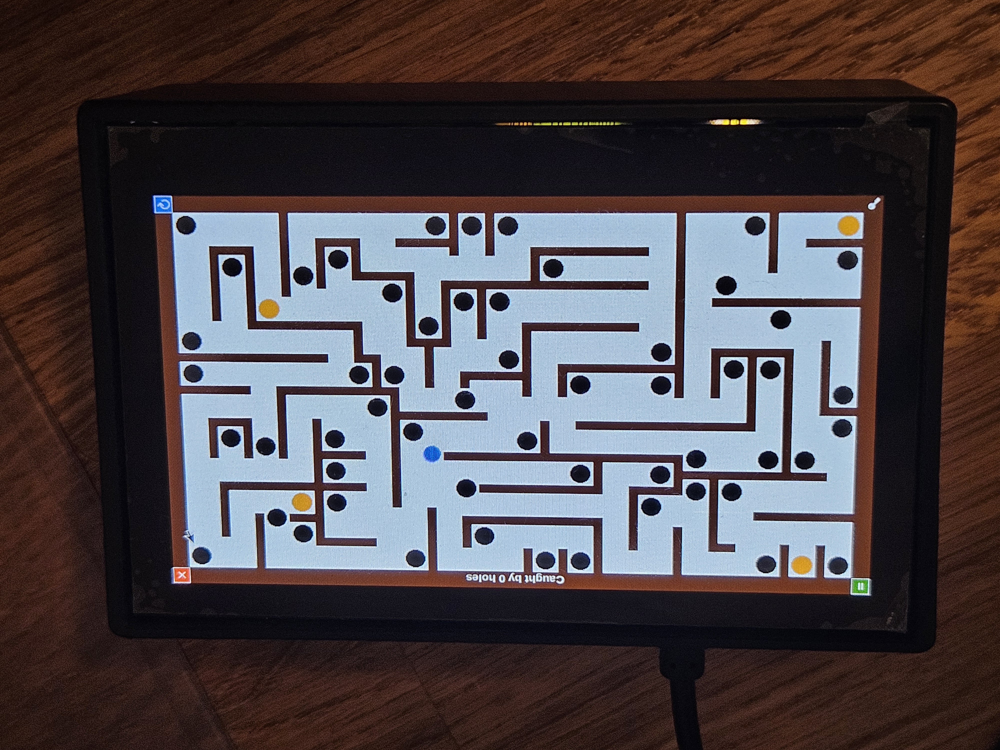

# Tilt Maze Game

## Overview

The Tilt Maze Game is inspired by the classic wooden labyrinth game where players navigate a ball through a maze by tilting the board.
This game uses a Raspberry Pi combinded with a touchscreen and a MPU6050 gyro sensor for tilt detection.
The objective of the game is to guide the ball from the start position to four checkpoints on the map while avoiding holes that will reset the ball's position. When reached, the checkpoints will each reveal a number/letter combination which has to be decoded. The resulting code then has to be entered to finish the game.

## The hardware

- <a href = "https://www.amazon.de/dp/B07BFH96M3?ref=ppx_yo2ov_dt_b_fed_asin_title&th=1"> Raspberry Pi 3B+ </a>
- <a href = "https://www.amazon.de/dp/B09B29T8YF?ref=ppx_yo2ov_dt_b_fed_asin_title&th=1"> 4.3" 800x480 px Waveshare Touchscreen with Case and Fan </a>
- <a href = "https://www.amazon.de/dp/B07BVXN2GP?ref=ppx_yo2ov_dt_b_fed_asin_title"> MPU6050 Gyro Sensor </a>
- <a href = "https://at.rs-online.com/web/p/entwicklungstools-fur-energie-motor-und-robotik/1845122?gb=s" > Vibration Motor </a>
- PCB with components and wires

### Cables and connections

The following image visualizes the hardware setup with all its components. The image shows a Raspberry Pi 3, but the project was actually built with a Raspberry Pi 3B+. However, it should also work with a Raspberry Pi 3. The DSI display is connected to the DSI port located on the left side. The MPU6050 gyro sensor is connected via I2C to the SDA and SCL pins of the Raspberry Pi. The vibration motor and the fan require more power than the GPIO pins can provide, therefore they are powered through a transistor circuit connected to the 5V and GND pins of the Raspberry Pi. Resistors connecting the base of the transistors to the GPIO pins are used to control the motors. To smooth out the fan rotation, capacitors are connected in parallel to the fan. Diods are used to protect the circuit from voltage spikes when turning off the motors. 


The following schematic and layout show the transistor circuit with the values of the components in detail.   

### Schematic

$V_{in1}$ for the Vibration motor control is connected to GPIO 14 and $V_{in2}$ for the fan control is connected to GPIO 15. $V_{CC}$ is connected to the 5V pin of the Raspberry Pi, while $GND$ is connected to a GND pin. The flyback diods $D_1$ and $D_2$ are 1N4007 diods. The capacitance of the Capacitors sum up to $440 \mu F$ (two 220 $\mu F$ Capacitors were used, because of availability). The resistors have a resistance of $220 \Omega$ to ensure that the Transisor works as a switch/ in saturation mode. The transistors are BC547B NPN transistors. The Fan is a 5V fan, while the vibration motor is a 3V motor. Therefore the vibration motor needs a resistor of $34 \Omega$ in series to limit the current to $~80 mA$.
When $V_{in1}$ or $V_{in2}$ is set to HIGH, the corresponding transistor $T_1$ or $T_2$ turns on and connects the motor to ground, allowing current to flow from $V_{CC}$ through the motor to ground, thus powering the motor.


### PCB layout

The double layer PCB shows the placement of the components and the connections on the top (yellow) and bottom (orange) layer. The dimensions of the PCB are $2 cm$ x $2 cm$.
On the left side the connections to the Raspberry Pi and the motors are located.


### Photos of the final setup


The raspberry pi is mounted in the back of the LCD screen and connected using a DSI cable (orange). The vibration motor and the fan are mounted inside the case.


The soldered PCB and the MPU6050 are mounted onto the raspberry pi with spacers.



The final setup with the case closed.

### Raspberry Pi Setup configuration

The Raspberry Pi was set up with the version 12 (Bookworm) of Raspberry Pi OS Lite (32 bit). To enable the DSI display the dtoverlay for the display driver has to be changed from the default "vc4-kms-v3d" to "vc4-fkms-v3d". This can be done by editing the file /boot/firmware/config.txt. Adding "nocomposite" ensures smoother graphics performance. The following line has to be added or changed in the config.txt file:

```
dtoverlay=vc4-fkms-v3d, nocomposite
```

A virtual environment for Python 3 is created to install the required libraries. The libraries used in the project are:
- numpy
- mpu6050-raspberrypi
- tkinter
- sys
- threading
- time
- datetime
- RPi.GPIO
- json
- re
- abc
- paho-mqtt

A shell script is used to start the game in the virtual environment. 
``` 
#!/bin/bash

# go to venv path
cd /home/gyropi/Documents/gyropython/

# activate venv
source bin/activate

# go to repository
cd /home/gyropi/Documents/gyropython/CompEng/

# start game
#python3 collision_v1.py
python3 main.py
```
 
### Cooling fan

The cooling fan gets controlled via a seperated programm (adaptive_cooling.py) added to the autostart. When the CPU temperature exceeds 58 °C the fan turns on with 30% and increases its speed with increasing temperature up to 100% at 100° C. The speed is regulated using Pulse Width Modulation (PWM) with 1kHz. 

### MPU6050 gyro sensor

The sensor is connected via I2C to the Raspberry Pi. To enable I2C the raspi-config tool can be used. The sensor is read out with the help of the mpu6050-raspberrypi library. With the use of that library the acceleration in x and y direction can be read out directly. The z acceleration is not used in the game. 

### Vibration motor

The vibration motor is controlled via a GPIO pin of the Raspberry Pi. The motor turns on when the  Raspberry Pi is booting. During Gameplay the motor vibrates when the ball falls into a hole or when the ball hits a wall.

## Map, ball movement and collision concept

The implementation of the map and the collision logic was a central part of the project. The map consists of walls acting as boundaries and obstacles, holes that reset the ball's position, and checkpoints which the player must reach. The map is based on a text file defining the objects.

### The map file

In the map file first the radius of holes and checkpoints is defined with the key 'r' followed by the value. Then all rectangular wall objects are defined with the key 'w' followed by coordinates of the top left and bottom right corners. The holes with the key 'h', the checkpoints with the key 'c' and the start position with 's', each are followed by the coordinates of their center.

### The map representation

In the program the map is represented by a 3D array storing a certain set of information for each pixel of the map; the first two indices of the array represent the x and y coordinates of the pixel, while the third index selects the information stored for that pixel. In the following "index" refers to the third index of the array, while the first two indices are referred to as "coordinates". In the code this array is called 'val_data'.

Index 0 defines the type of the pixel and with this if it represents a valid position for the center of the ball (which will be reffered to as 'ball' in this section). The following types are defined: 

- 2: Wall; obviously the ball cannot move into walls
- 1: Wall periphery; the ball cannot move into these pixels
- 0: Valid; the ball can move into these pixels
- -1: Hole area; the ball can move there but is drawn to the center of the hole
- -2: Hole center; the ball can move there but "falls" into the hole
- -3: Checkpoint; the ball can move there and reveals the number/letter pair of the checkpoint

In order to implement the collision logic it is required to know the orientation of the obstacle surface, i.e. the direction perpendicular to the surface of the wall. This information is stored in index 1 and 2 of the array as x and y components of a 2D vector for each wall periphery pixel.

If a pixel is within a checkpoint, index 3 stores the identification number of the checkpoint (0 to 3)

The data in the array is generated in the following way (after initializing the information part with zeros):

1. The walls are drawn first. For each wall the pixels within the defined rectangle are set to type 2, shown in the following figure in blue.
Also in this step holes and checkpoints are drawn (more about these later) - this way further layers defining forbidden areas in the periphery of walls can override them (otherwise areas to close to walls could be defined as valid position for the center of the ball).


2. Then the wall periphery is defined by adding rectangles with the width equal to the radius of the ball at each side of the wall as long as there isn't another wall at this position already. These pixels are set to type 1, shown in the figure as yellow rectangles


3. As a last step, quarter-circles with the radius of the ball are added at each (unoccupied) corner of the wall, again setting the pixels to type 1. These are shown in green in the following figure.


In step 2 and 3 besides setting the type of the pixel, also the normal vectors in the wall periphery are defined. For the rectangles in step 2 the normal vector is simply pointing away from the wall, while for the quarter-circles in step 3 the vectors were generated by taking the position of each pixel relative to the center of the quarter-circle and normalizing it.
The following figure shows the normal vectors in the wall periphery - the pixeltype is shown in a grayscale where walls are the darkest, the wall periphery is a medium gray and the valid area is the lightest. In the areas where two periphery rectangles overlap, the normal vectors are added, resulting in diagonal vectors, leading to the intended behavior.


As mentioned before, holes and checkpoints are drawn in step 1. Both are drawn as circles with the defined radius. The pixels within the circle are set to type -1 (hole area) or -3 (checkpoint), while for the hole a few pixels in the center are set to type -2 (hole center). For the checkpoints thats enough, but for the holes to pull the ball to the center, vectors are needed. For this a similar approach as for the quarter-circles in step 3 is used: The position of each pixel within the hole relative to the center of the hole is calculated, reversed and normalized in such way that the vectors point to the center of the hole and their length grows towards the center. This leads to behavior that is somewhat similar to a ball rolling into a hole; if it just touches the periphery of the hole, there is a chance for it to escape, while if it gets closer to the center, it is pulled in more strongly. The following figure shows the vectors within a hole again with the pixeltype in grayscale where the valid area around is the darkest, the hole area is a medium gray and the hole center is the lightest.


Since the pixeltype defines the type of each pixel based on the coordinates on the screen, this representation can be used to draw a grayscale image of the map, which is shown in the next figure. The walls have the value 2 (darkest), the wall periphery 1, the valid area 0, the hole area -1, the hole center -2 and the checkpoints -3 (lightest).


### Collision logic

Since the game is designed to update the screen with $50$ Hz, the time between two frames is $20$ ms. Therefore in each frame the ball travels a certain distance based on its velocity ($s=v\cdot dt$ with $dt = 20$ ms). If the velocity is high, the ball could travel several pixels in one frame and therefore end up inside forbidden areas. To prevent this, the trajectory of the ball is divided into smaller steps of $ds = 0.1$ px length and at each step the current pixel type is checked.
The following image illustrates this process: The vector $\vec{t_1}$ represents the initial trajectory of the ball. The green dots represent the positions at which the pixel type is checked - they are separated by the step size $ds$. At the position of the red dot the trajectory enters a pixel of type 1 (wall periphery) - starting from the last valid position a new trajectory $\vec{t_2}$ is calculated based on the normal vector $\vec{n}$ stored at the position of the collision. Therefore the direction of the trajectory is mirrored at the normal vector and the length is set to the remaining distance to travel reduced by a damping factor (0.8). The new trajectory is then again divided into steps tested for collisions. On the screen the ball is only drawn on the final position of the trajectory.


The calculation of the new trajectory is done with vector algebra: 

The projection of the incoming trajectory $\vec{t_1}$ on the normal vector $\vec{n}$ is calculated with the dot product:

$$\vec{v_p} = \frac{\vec{t_1} \cdot \vec{n}}{|\vec{n}|^2} \cdot \vec{n}$$

The projection vector can then be used to calculate the component of the trajectory perpendicular to the normal vector:

$$\vec{v_\perp} = \vec{v_p} - \vec{t_1}$$

The new (undamped) trajectory is then obtained by calculating $-\vec{v_p} - \vec{v_\perp}$:

$$\vec{t_2} = -\vec{v_p} - \vec{v_\perp} = -2 \cdot \vec{v_p} + \vec{t_1}$$


For some special cases where the projection vector points in the same direction as the normal vector (at the "corner circles"), the above calculation would lead to the new trajectory pointing into the wall. To prevent this, in these cases the new ball is simply pushed one stepsize away from the wall along the normal vector and keeps moving in the same direction as before.


## Software structure


### Classes
The game is implemented in Python, based on a number of classes:
- GameApp: Main class handling the game loop, screen updates, user input and feedback
- GameConfig: Class storing configuration parameters for the game and ball physics
- GameMap: Class handling the map loading, representation and drawing
- Ball: Class representing the ball object, including its physics and interactions
- Checkpoint: Class representing checkpoints in the game
- InputControl: Abstract parent class for input handling
- VibroMotor: Class handling the vibration feedback for the user
- MQTTClient: Class handling the MQTT communication with the central station (usage optional)
- Overlay: Class storing the overlay objects for the game

Further details about the classes and their functions can be found in the code.

### Configuration

The game config class reads the data stored in the config.json file. The following parameters can be configured:

- "control": "mpu6050" or "keyboard" - defines if the game is controlled via the gyro sensor or keyboard input (for testing on pc without sensor)
- "online_mode": true/false - if true the game tries to connects to the MQTT broker (if it fails it is set to false)
- "mpl_debug": true/false - if true matplotlib is used to plot the ball trajectory for debugging purposes (after the game ends - in the main.py file)
- "checkpoints": string with the four number/letter pairs revealed at the checkpoints in a changed order ("1H\t9O\t7L\t0E" -> HOLE with 1970 as code)
- "time_step_size": int - time step size in ms for the game loop (20 ms -> 50 Hz)
- "position_step_size": float - step size in px for checking the ball trajectory for collisions (0.1 px currently)
- "acceleration_factor": float - factor to scale the acceleration of the ball based on the gyro sensor input (100 currently)
- "damping_factor": float - factor to reduce the ball velocity after a collision: $0 \leq x \leq 1$ (0.8 currently)
- "ball_radius": int - radius of the ball in px (10 currently)
- "hole_radius": int - radius of the holes in px (12 currently)
- "map_file_name": string - name of the map file (map_v1.txt currently)
- "broker": string - address of the MQTT broker
- "port": int - port of the MQTT broker
- "topic": string - topic for the MQTT communication ("pr_embedded/puzzle_tilt_maze" currently)
- "username": string - username for the MQTT broker
- "password": string - password for the MQTT broker
- "screen_width": int - width of the screen in px (800 - do not change for the 4.3" display)
- "screen_height": int - height of the screen in px (480 - do not change for the 4.3" display)
- "fan_gpio": int - GPIO pin number for the fan control (15 currently)
- "vibration_gpio": int - GPIO pin number for the vibration motor control (14 currently)

## How to run the game

### Starting the program
When the program is started in online mode, it tries to connect to the MQTT broker; meanwhile the player sees a welcome screen with a disabled button. If the connection is successful and the broker sends a "initialize" message on the subscribed topic, the program publishes a "initialize_ack" message and the button is enabled and the player can start the game by pressing it. If the connection to the broker fails, the online mode is disabled and the player gets a error message, but can still start the game in offline mode. If the online mode is disabled, the player can immediately start the game by pressing the button.

### Playing the game
When the game is started, the ball appears at the start position and the player can navigate it through the maze by tilting the raspberry pi with the gyroscope sensor or pressing the arrow keys - depending on the "control" configuration. When the online mode is disabled, a timer starts to track the time taken to finish the game. For performance reasons the timer is not shown during the game if it is controlled by the mpu6050.

### Gameplay
The objective is to reach all four checkpoints, which reveal a number/letter pair each and sets the startpoint there. On the way there the ball can fall into holes which resets its position to the start or last checkpoint. Further the number of times the ball falls into holes is counted to deduct points at the end.
When the ball hits a wall, the vibration motor gives a short haptic feedback to the player. If the ball falls into a hole, it is stuck there for half a second before being reset to the startpoint or last checkpoint. During this time the vibration motor gives a longer haptic feedback.
If the game is not played on the raspberry pi, instead of the haptic feedback a red dot flashes on the top left of the screen instead of the vibration.

### Finishing the game
When all checkpoints are reached, the game is finished and a new overlay opens the player has to enter a four digit code. This code can be deduced from the number/letter pairs revealed at the checkpoints. Threfore the players has to arrange the letters to form a word and combine the numbers in the same order to get the code.
As soon as the code is entered, the game shows the final overlay.
- If the game is finished in online mode, the program publishes the number of points lost as well as "finished" to the broker. These point are calculated based on the number of times the ball fell into a hole (5 points lost each, 45 max).
- If the online mode is disabled, the final overlay shows the time taken to finish the game as well as the number of times the ball fell into holes.

### Further features

#### Pausing the game
On the top left of the screen there is a button to pause the game which also pauses the timer.

#### Toggle code overlay
The code overlay can also be opened by pressing the coresponding button located on the bottom left of the screen if the player wants to enter the code before reaching all checkpoints (this could be the case if hints bought in the online mode reveal the complete code). This also pauses the game. Pressing the button again closes the overlay and resumes the game.

#### Restarting the game
If the online mode is disabled, the game can be restarted by pressing the restart button on the bottom right of the screen. In online mode the game can only be restarted if the broker sends "initialize" again.

## Screenshots
The first image shows the initial screen when the program is started and initialized - the player can start the game by pressing the "Go" button.


The following image shows the game during gameplay with the ball at the start position in the middle of the map. It is running in offline mode on the pc, therefore the timer is shown and the gray dot on the top left next to the pause button is used to indicate collisions instead of the vibration motor (color changes to red). Further the restart button in the bottom right corner  is shown because of the offline mode. The checkpoints are shown as orange circles, as they are not yet reached; the black circles are holes.
On this map each of the four checkpoints can be reached via a unique path from the center and between three of them, there are connecting paths as well.


The next image shows the game after the last checkpoint is reached: the checkpoints are now green with a number/letter pairs and the code overlay is opened to enter the code.


The last image shows the final overlay after entering the correct code. The game was played in offline mode, therefore the time taken and the number of times the ball fell into holes is shown.

