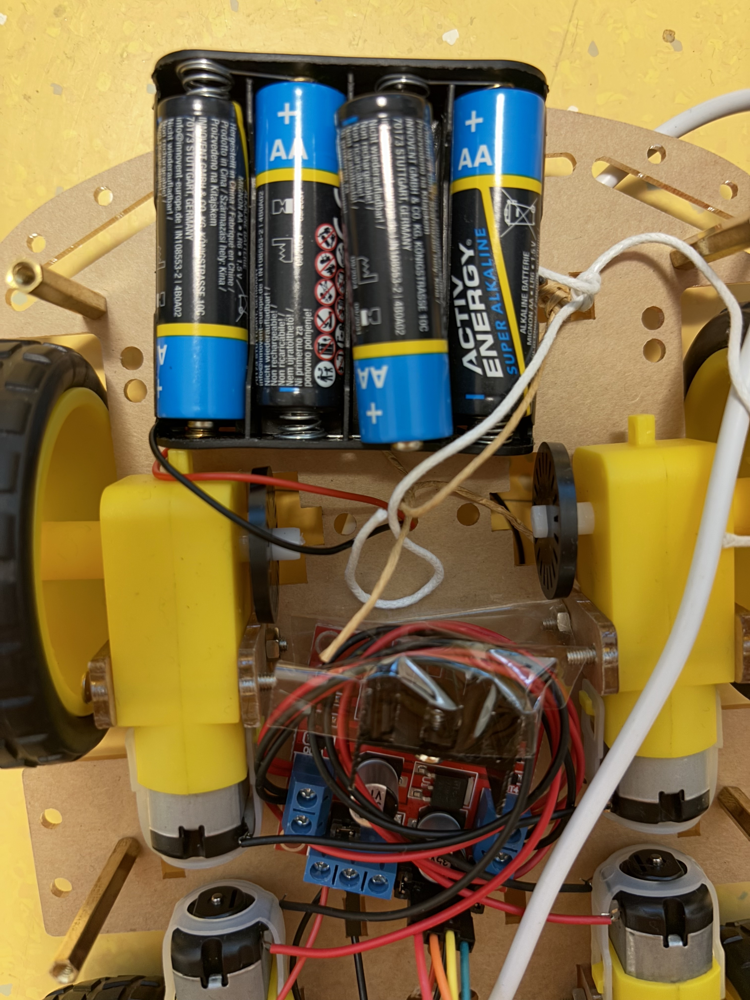

# embedded-project


### Install OS
- Install Raspberry Pi OS using the Raspberry Pi Imager.
- Enable SSH and Wi-Fi settings during imaging.

### Install Package
Run the following commands to update your system and install required Python packages:
```
sudo apt update
sudo apt install python3-picamera2 python3-lgpio
install flask
```

### Clone the Repository
Clone the project from GitHub:
```
git clone git@github.com:litcpslab/floppiano.git
```

### Configure Environment Variables
Create a .env file inside the remote_car_puzzle directory:
```
MQTT_BROKER=TODO
MQTT_PORT=1883
MQTT_TOPIC_GENERAL=TODO
MQTT_TOPIC_POINTS=TODO
MQTT_USERNAME=TODO
MQTT_PASSWORD=TODO
```
Your .env file path should look like:
floppiano/remote_car_puzzle/.env

### Assemble the car
#### Components:
- Raspberry Pi 4 × 1
- Wheels × 4
- DC Motors × 4
- L298N H-Bridge Motor Driver × 1
- Battery Box (for AA batteries) × 1
- AA Batteries × 4
- Lithium Battery × 1
- Battery Management Board × 1
- Camera Module × 1
- Chassis Plates (Car Boards) × 2

#### Steps

- Connect Motors to Motor Driver and Raspberry Pi
  - Connect the two motors on the same side to Motor A outputs (OUT1 and OUT2).
  - Connect the other two motors to Motor B outputs (OUT3 and OUT4).
  - Solder the motor wires to prevent them from detaching during movement.


- Connect Battery Box to Motor Driver
  - Connect the red wire from the battery box to the motor driver's +12V input.
  - Connect the black wire to the motor driver's GND.



- Connect Motor Driver to Raspberry Pi GPIO

| Motor Driver Pin | Raspberry Pi GPIO | Raspberry Pi Physical Pin
| ------- | ------- | ------- |
| GND | GND | Pin 34
| Input 1 | GPIO 17 | Pin 11 |
| Input 2 | GPIO 22 | Pin 15 |
| Input 3 | GPIO 23 | Pin 16 |
| Input 4 | GPIO 24 | Pin 18 |


- Connect Lithium Battery to Raspberry Pi
    - Connect the lithium battery to the UPS board.
    - Connect the UPS board to the Raspberry Pi using either:
        - A USB Type-A to USB Type-C cable
        - Soldering the UPS board's output pins and connecting them to the Raspberry Pi using wires.


- Connect the Camera to Raspberry Pi
  - Connect the camera module to the CSI port on the Raspberry Pi.
  - Ensure the connection is correct and the ribbon cable is securely inserted.
  - Always connect the camera before booting the system.


- Mount All Components to the Chassis
    - Use screws to secure components to the car boards.
    - Use strings or zip ties as additional support to hold batteries, boards, or loose components in place.
- Charging the Lithium Battery
    - To charge the lithium battery, connect a USB Type-C charger to the UPS board.
    - The UPS board will handle charging and power delivery to the Raspberry Pi automatically.
    - Ensure the battery is connected to the UPS board before charging.

### Start the car
- Check Power Supply
    - Ensure all AA batteries are properly installed in the battery box.
    - Switch on the power supply on the UPS board to power the Raspberry Pi.
- MQTT Connection Required
    - The system will not start successfully if it cannot connect to the configured MQTT server.
    - Make sure your .env file is set up correctly and the MQTT broker is running.
- Start the Backend Server
```
cd remote_car_puzzle
python3 server.py
```
- Access the Web Interface
    - Open a web browser and go to: https://{raspberry-pi-ip}:5000
    - Replace <raspberry-pi-ip> with the actual IP address of your Raspberry Pi on the local network.

### Maze Setup
- Build the maze using cardboard or other available objects in the room.
- Ensure paths are wide enough for the car to move and push objects.
- Use tape or glue to keep the maze stable during movement.
- Feel free to adjust the difficulty of the maze based on your testing or preferences — make it as simple or challenging as you'd like.

### QR Code Puzzle
- Generate QR Codes
    - Use an online QR code generator to create three unique QR codes.
    - Print and cut each QR code in half vertically or horizontally.
- Prepare Puzzle Pieces
    - Attach one half of each QR code to a movable square object (e.g., a small box).
    - Fix the other half to a wall or surface inside the maze, aligned with the object's intended final position.
- Objective
    - The car must push the object so that the two halves of the QR code align correctly.
    - Once aligned, the car’s camera scans the full QR code to complete the puzzle.

## Reference
- UPS docs: https://github.com/rcdrones/UPSPACK_V3/blob/master/README_en.md
- Motor Driver: https://sharad-rawat.medium.com/interfacing-l298n-h-bridge-motor-driver-with-raspberry-pi-7fd5cb3fa8e3